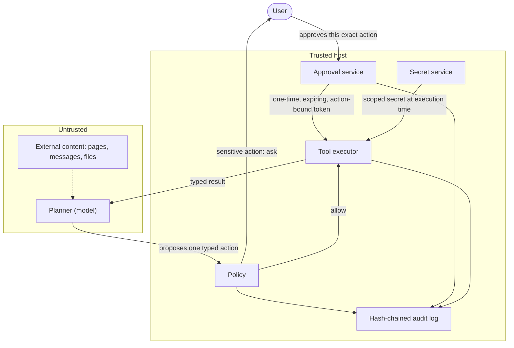

<p align="center">
  
</p>

<h1 align="center">OpenMuse</h1>

<p align="center">
  A local-first, auditable personal AI agent runtime.<br>
  Untrusted planners stay behind typed tools, exact-action approvals, isolated workers, encrypted secrets, and verifiable audit history.
</p>

<p align="center">
  <a href="https://github.com/tahodev/openmuse/actions/workflows/ci.yml"></a>
  <a href="LICENSE"></a>
</p>

## Why OpenMuse is different

OpenMuse is a small, readable runtime whose safety claims are enforced in code and covered by tests:

- **Exact-action approval.** The host signs each approval token for one tool call and its exact arguments. Tokens expire, can be consumed once, and cannot be minted by the planner.
- **Verifiable audit.** Decisions land in a redacted, hash-chained local log. Signed checkpoints can be published to an independent store so later verification can detect rewritten history.
- **Secrets stay outside planner context.** A process-separated service decrypts secrets for the host at execution time. Secret values do not enter action arguments, tool manifests, or the audit log.
- **Bounded execution.** Typed schemas, budgets, SSRF-resistant fetches, resource-limited workers, and a network-isolated container profile constrain what a proposed action can do.

## See the safety boundary in 30 seconds

The demo starts a task, pauses before a write, approves that exact action, runs it, and verifies the resulting audit chain.

[](https://asciinema.org/a/MYdPbeccAUeoC8uy)

This is a real terminal capture. Its raw, replayable cast is [checked into the repository](docs/assets/openmuse-demo.cast).

## Run it locally

Requires Python 3.11+ and Git. The deterministic demo needs no API key.

```bash
git clone https://github.com/tahodev/openmuse.git
cd openmuse
python -m venv .venv
source .venv/bin/activate             # Windows: .venv\Scripts\activate
python -m pip install -e '.[dev]'
python examples/e2e_demo.py
```

The demo pauses at its sensitive write so you can inspect and approve it. Then independently verify every audit hash and link:

```bash
python examples/verify_audit.py
```

Expected result:

```text
VERIFIED: 3 records form an intact hash chain
```

Change any audited byte and verification fails. More credential-free paths are indexed in [`examples/`](examples/README.md).

## The approval boundary

The planner and everything it reads are untrusted. Only the host can issue an approval, and that approval is bound to one exact action:



`Channel -> durable Task -> Planner -> typed Action -> Policy/Approval -> Tool -> typed Result`

See the [architecture](docs/architecture.md), [threat model](docs/threat-model.md), and [product foundation](docs/product-foundation.md) for the full boundary.

## Use a real model

`OpenAICompatiblePlanner` supports OpenAI-compatible chat-completions endpoints. Use a test key and non-sensitive data while OpenMuse is alpha.

```python
import os
from pathlib import Path

from openmuse.core import Agent
from openmuse.policy import Policy
from openmuse.providers import OpenAICompatiblePlanner
from openmuse.tools import ReadFile

agent = Agent([ReadFile(Path.cwd())], Policy(), Path(".openmuse/audit.jsonl"))
planner = OpenAICompatiblePlanner(api_key=os.environ["OPENAI_API_KEY"])
print(agent.run("Read README.md and stop", planner))
```

The deterministic demo remains the recommended first run because it is free and reproducible.

## Project status

OpenMuse is an **alpha security-primitives runtime and reproducible demo**, not a production personal assistant. “Working” means implemented and covered by the current test suite, not independently audited or safe for unattended sensitive accounts.

| Area | Working now | Remaining production gate |
|---|---|---|
| Safety | Exact-action approvals, persistent single-use decisions, schema validation, SSRF-resistant fetch, redacted hash-chained audit, signed checkpoints | Publish checkpoints to an independent append-only store; complete independent security review |
| Runtime | Budgeted planner loop, durable tasks, timezone-aware atomic cron claims, narrowing subagents, resource-limited process worker, CI-validated locked-down container profile | Validate the chosen container or VM runtime in deployment; provide a production approval UI |
| Data and secrets | Verifiable memory, encrypted vault, OS-keyring master key, process-separated authenticated secret service | Add a hardware-backed master-key provider and deployment-specific key operations |
| Connectors | Credential-free simulations, read-only Gmail and Google Calendar, managed OAuth with revocation | Independently deploy the OAuth callback and add reviewed providers |
| Channels | In-process web adapter and browser-worker policy envelope | Add authenticated hosted routes and validate isolated browser deployment |

Do not use OpenMuse with sensitive production accounts yet. Deployment guidance and open gates live in the [roadmap](docs/roadmap.md), [container profile](docs/container-worker.md), [audit anchoring guide](docs/audit-anchoring.md), [approval service guide](docs/approval-service.md), and [secret service guide](docs/secret-service.md).

The Python distribution is named `openmuse-agent`. Unlike [Digger's deployable OpenMuse assistant](https://github.com/diggerhq/openmuse), this project focuses on host-enforced approval, bounded execution, and verifiable local audit trails.

> Independent project. Not affiliated with or endorsed by Meta. No Meta code, branding, or assets are used.

## Contributing

See the [public API policy](docs/public-api.md), [scheduling semantics](docs/scheduling.md), [CONTRIBUTING.md](CONTRIBUTING.md), [governance](GOVERNANCE.md), and [code of conduct](CODE_OF_CONDUCT.md). Starter work is tracked with [`good first issue`](https://github.com/tahodev/openmuse/labels/good%20first%20issue) and [`help wanted`](https://github.com/tahodev/openmuse/labels/help%20wanted) labels.

## License

MIT.
