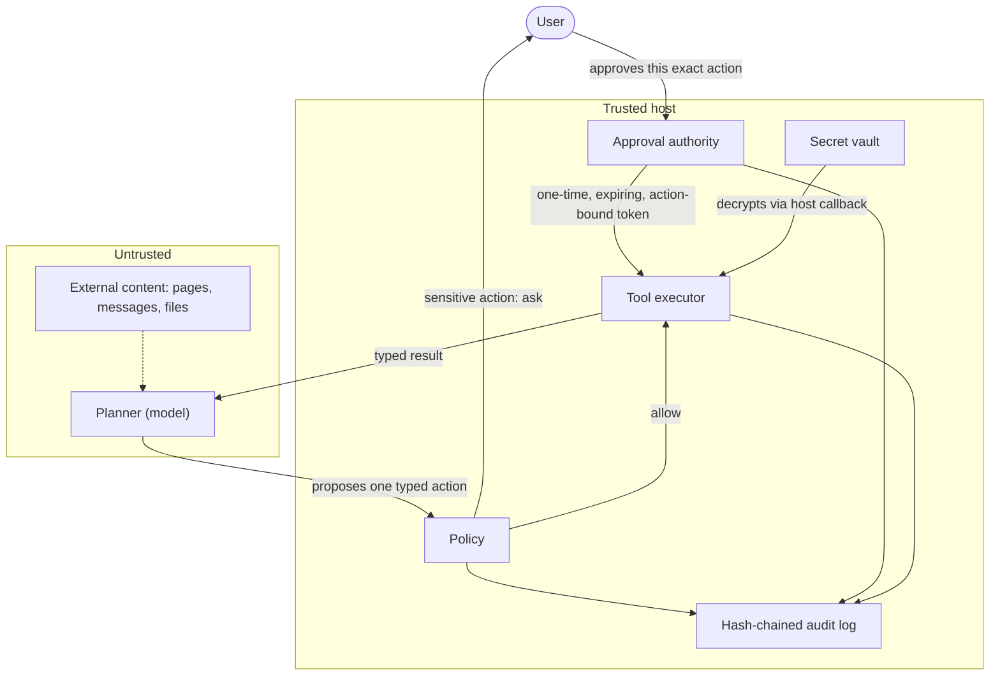

# OpenMuse

[](https://github.com/tahodev/openmuse/actions/workflows/ci.yml)
[](#status)
[](https://pypi.org/project/openmuse-agent/)
[](LICENSE)
[](https://codespaces.new/tahodev/openmuse?quickstart=1)

A local-first, auditable personal AI agent runtime. OpenMuse separates untrusted planners from typed tools, host-issued approvals, durable tasks, encrypted secrets, and redacted audit history.

## Why OpenMuse is different

The goal is the smallest readable personal-agent runtime whose safety semantics are verified in code and tests:

- **Exact-action approval.** The host signs each approval token against one action's tool and arguments. Tokens expire and can be consumed exactly once. The planner cannot mint approvals, and approving one action never approves a similar-looking one.
- **Verifiable audit.** Every decision lands in a redacted, hash-chained local log that you can re-verify independently. Change one audited byte and verification fails.
- **Secrets never reach the model.** Tools receive decrypted secrets through a host callback at execution time. Secret values never appear in planner context, action arguments, tool manifests, or the audit log.

## See the safety boundary in 30 seconds

One simple story: the agent starts a task, pauses before one write, the user approves exactly that action, it runs, and the audit chain proves what happened.

[](https://asciinema.org/a/MYdPbeccAUeoC8uy)

This is a real terminal capture. Its raw, replayable cast is also [checked into the repository](docs/assets/openmuse-demo.cast).

## The approval boundary

The planner and everything it reads are untrusted. Only the trusted host can issue an approval, and it issues one for the exact action the user approved:



## Use a real model

`OpenAICompatiblePlanner` supports OpenAI-compatible chat-completions endpoints. Set `OPENAI_API_KEY` and pass the planner to `Agent.run()`. This is an alpha adapter: use a test key and non-sensitive data.

```python
import os
from pathlib import Path
from openmuse.core import Agent
from openmuse.policy import Policy
from openmuse.providers import OpenAICompatiblePlanner
from openmuse.tools import ReadFile

agent = Agent([ReadFile(Path.cwd())], Policy(), Path(".openmuse/audit.jsonl"))
planner = OpenAICompatiblePlanner(api_key=os.environ["OPENAI_API_KEY"])
print(agent.run("Read README.md and stop", planner))
```

The deterministic demo remains the recommended first run because it is free and reproducible. More runnable paths are indexed in [`examples/`](examples/README.md).

**Current scope:** an alpha security-primitives runtime and reproducible demo, not a production personal assistant. Unlike [Digger's deployable OpenMuse assistant](https://github.com/diggerhq/openmuse), this project focuses on host-enforced exact-action approval and verifiable local audit trails. The Python distribution is named `openmuse-agent`.

> Independent project. Not affiliated with or endorsed by Meta. No Meta code, branding, or assets are used.

## Run it

The quickest path opens a ready Python environment. In the terminal, run `python examples/e2e_demo.py` so you can inspect and approve the exact write yourself:

[](https://codespaces.new/tahodev/openmuse?quickstart=1)

Or run locally with Python 3.11+ and Git:

```bash
git clone https://github.com/tahodev/openmuse.git
cd openmuse
python -m venv .venv
source .venv/bin/activate             # Windows: .venv\Scripts\activate
pip install -e '.[dev]'
python examples/e2e_demo.py
```

The deterministic demo needs no API key. It keeps the existing web-channel and durable-task flow, but makes the one sensitive write and its host-issued approval visible.

## Verify, don't trust

After the demo, independently recompute every audit hash and link:

```bash
python examples/verify_audit.py
```

Expected result:

```text
VERIFIED: 3 records form an intact hash chain
```

Change any audited byte and verification fails. The verifier is intentionally small: [examples/verify_audit.py](examples/verify_audit.py) calls the public [`verify_chain`](src/openmuse/audit.py) function. The audit contains a blocked attempt, the approved action, and its execution result.

## Status

| Area | Working now | Remaining production gate |
|---|---|---|
| Safety | Exact-action approvals, schema validation, SSRF-resistant fetch, redacted hash-chained audit | Independent security review and external audit anchoring |
| Runtime | Budgeted planner loop, durable tasks, atomic cron claims, narrowing subagents, [resource-limited process worker](docs/isolated-worker.md) | [container isolation profile](docs/container-worker.md) deployment validation or VM isolation; production approval UI |
| Data and secrets | Verifiable memory, encrypted vault, secrets broker, OS-keyring master key | Process-separated secret service and hardware-backed keys |
| Connectors | Credential-free simulations plus read-only Gmail and Google Calendar with managed OAuth | Independently deployed OAuth callback and more providers |
| Channels | In-process web adapter and browser-worker policy envelope | Authenticated hosted routes and isolated browser deployment |

Do not use OpenMuse with sensitive production accounts yet. “Working” means covered by the current test suite, not externally audited.

## How it works

`Channel -> durable Task -> Planner -> typed Action -> Policy/Approval -> Tool -> typed Result`

The model cannot mint approval tokens. Secret decryption happens through a host callback, not planner context. See [architecture](docs/architecture.md), [threat model](docs/threat-model.md), [product foundation](docs/product-foundation.md), and [roadmap](docs/roadmap.md).

## What OpenMuse is and is not

| In scope today | Not yet |
|---|---|
| Typed local tools, bounded loops, exact-action approval, encrypted local vault, durable tasks, audit verification, simulated mail/calendar connectors | Production browser isolation, independently deployed OAuth callback, independent security review, unattended use with sensitive accounts |

## Contributing

See the [public API policy](docs/public-api.md), [scheduling semantics](docs/scheduling.md), [CONTRIBUTING.md](CONTRIBUTING.md), [governance](GOVERNANCE.md), and the [code of conduct](CODE_OF_CONDUCT.md). Starter work is tracked with [`good first issue`](https://github.com/tahodev/openmuse/labels/good%20first%20issue) and [`help wanted`](https://github.com/tahodev/openmuse/labels/help%20wanted) labels.

## License

MIT.
